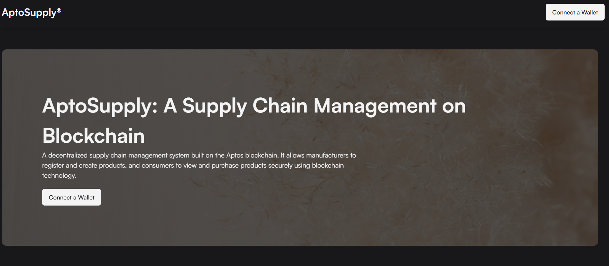
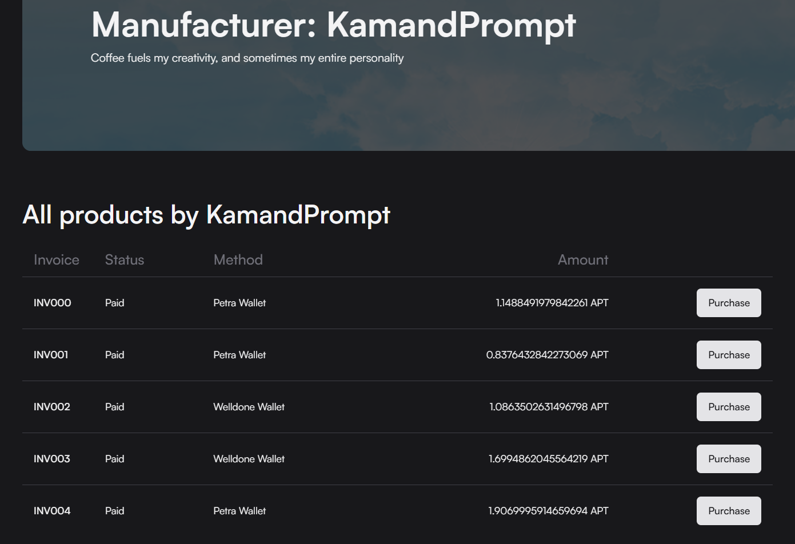

# Supply Chain Management on Aptos Blockchain

## Overview

This project is a decentralized supply chain management system built on the Aptos blockchain. It allows manufacturers to register and create products, and consumers to view and purchase products securely using blockchain technology. The smart contract manages product creation, listing, and purchasing, ensuring transparency and immutability. Additionally, it tracks all registered manufacturers and their products in a global, decentralized manner.


### Key Features
- **Manufacturer Registration**: Manufacturers can register on the platform by providing an account and a name.
- **Product Creation**: Manufacturers can create products with details like product ID, name, batch number, manufacture date, and price.
- **Global Manufacturer List**: A global list of manufacturers is maintained on the blockchain and is accessible by all users.
- **Product Purchase**: Consumers can purchase products from manufacturers using AptosCoin, with the transaction securely handled on-chain.
- **Immutable Records**: All product and manufacturer information is stored immutably on the blockchain.


## Smart Contract Details

### Modules
- **Manufacturer**: This struct contains details about a manufacturer, such as their account and name.
- **Consumer**: This struct tracks consumer accounts and their purchases.
- **Product**: Contains product details like ID, name, manufacturer address, batch number, manufacture date, and price.
- **ManufacturerProducts**: Stores a list of products associated with each manufacturer.
- **AllManufacturers**: Tracks a global list of all registered manufacturers on the blockchain.

### Functions
- **`init_all_manufacturers(account: &signer)`**: Initializes the global list of manufacturers.
- **`init_manufacturer(account: &signer, manufacturer_name: String)`**: Registers a new manufacturer and adds them to the global manufacturer list.
- **`create_product(account: &signer, product_id: u64, product_name: String, batch_number: u64, manufacture_date: u64, product_price: u64)`**: Allows a manufacturer to create a new product.
- **`get_all_manufacturers(): vector<address>`**: Retrieves a list of all registered manufacturers.
- **`get_product(manufacturer_address: address, product_id: u64): Option<Product>`**: Retrieves the details of a specific product from a manufacturer.
- **`purchase_product(account: &signer, manufacturer_address: address, product_id: u64)`**: Allows a consumer to purchase a product from a manufacturer by transferring the specified amount of AptosCoin.


## Usage

### Prerequisites

- Aptos CLI and Aptos framework installed.
- An Aptos testnet account with AptosCoin for transactions.
- Rust (for testing purposes, if needed).

### Setup

1. **Clone the Repository**:
    ```bash
    git clone <repository-url>
    cd aptos-hackathon
    ```

2. **Compile the Move Contracts**:
    To compile the smart contracts, use the Aptos CLI:
    ```bash
    aptos move compile
    ```

3. **Run Tests** (Optional):
    You can test the Move modules by running the following command:
    ```bash
    aptos move test
    ```

4. **Deploy to Aptos Testnet**:
    Ensure you have an Aptos testnet account set up. Then, deploy the contract:
    ```bash
    aptos move publish --profile testnet
    ```

### Interacting with the Contract

Once deployed, you can interact with the contract by calling the various functions:

1. **Register Manufacturer**:
    ```bash
    aptos move run --function-id '<deployed_address>::supplyChain::Product::init_manufacturer' --args <manufacturer_name>
    ```

2. **Create a Product**:
    ```bash
    aptos move run --function-id '<deployed_address>::supplyChain::Product::create_product' --args <product_id> <product_name> <batch_number> <manufacture_date> <price>
    ```

3. **Purchase a Product**:
    ```bash
    aptos move run --function-id '<deployed_address>::supplyChain::Product::purchase_product' --args <manufacturer_address> <product_id>
    ```

4. **Get All Manufacturers**:
    ```bash
    aptos move run --function-id '<deployed_address>::supplyChain::Product::get_all_manufacturers'
    ```

## Example Workflow

1. **Initialize the Global Manufacturer List**:
    The first step is to initialize the global manufacturer list, which is done only once:
    ```bash
    aptos move run --function-id '<deployed_address>::supplyChain::Product::init_all_manufacturers'
    ```

2. **Register a Manufacturer**:
    After the global list is initialized, manufacturers can register by providing their account and name:
    ```bash
    aptos move run --function-id '<deployed_address>::supplyChain::Product::init_manufacturer' --args '<manufacturer_name>'
    ```

3. **Create a Product**:
    Once registered, manufacturers can create products:
    ```bash
    aptos move run --function-id '<deployed_address>::supplyChain::Product::create_product' --args <product_id> <product_name> <batch_number> <manufacture_date> <price>
    ```

4. **Purchase a Product**:
    Consumers can purchase a product by sending AptosCoin to the manufacturer's account:
    ```bash
    aptos move run --function-id '<deployed_address>::supplyChain::Product::purchase_product' --args <manufacturer_address> <product_id>
    ```

5. **Retrieve Manufacturer List**:
    To view the list of all manufacturers:
    ```bash
    aptos move run --function-id '<deployed_address>::supplyChain::Product::get_all_manufacturers'
    ```

## Error Codes

- **1**: Global manufacturer list already initialized.
- **2**: Manufacturer already registered.
- **3**: Product not found.
- **4**: Insufficient AptosCoin balance.

## License

This project is licensed under the MIT License.
